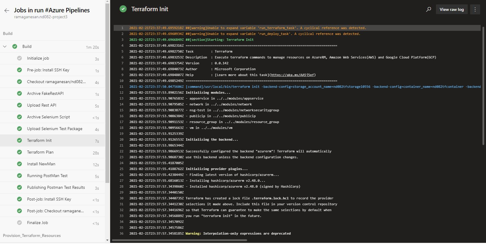
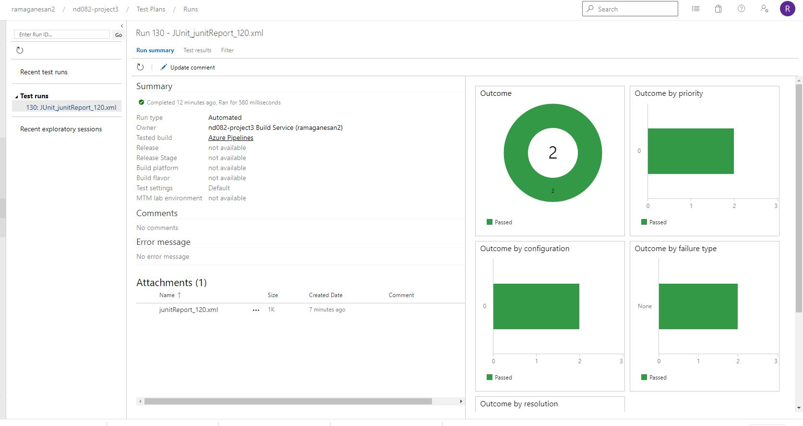
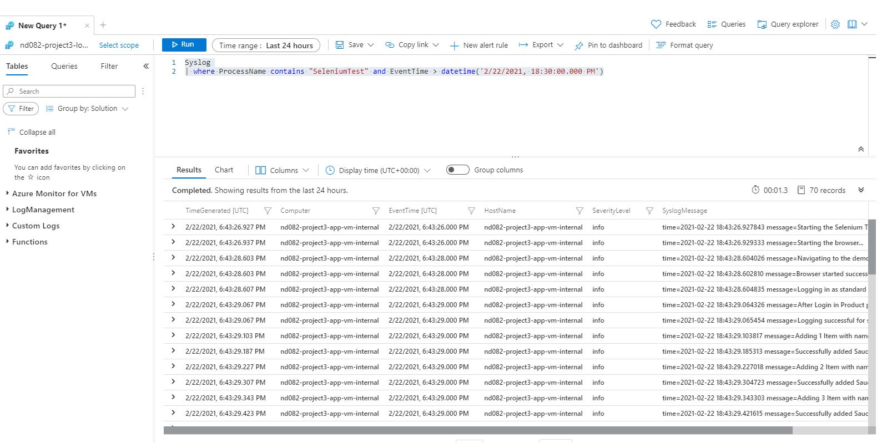
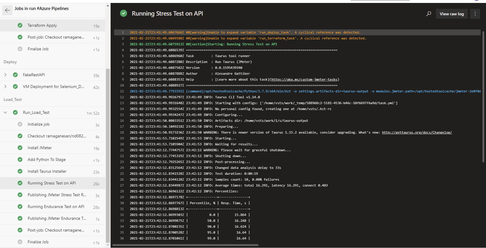
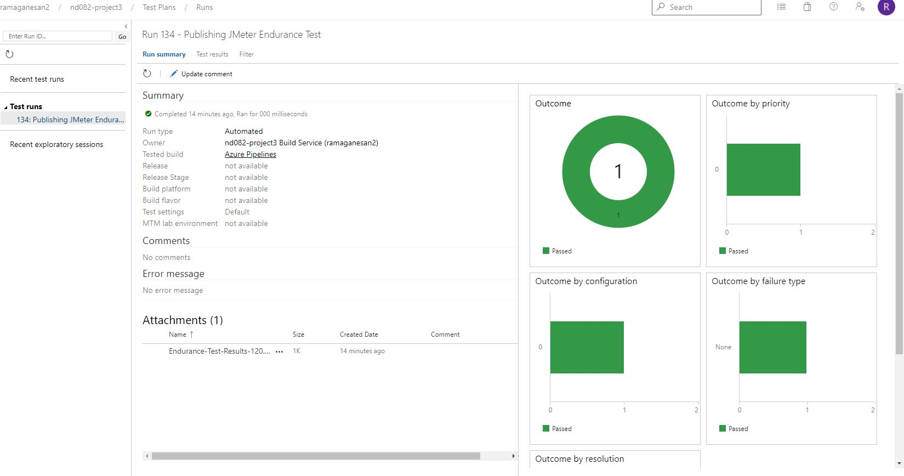
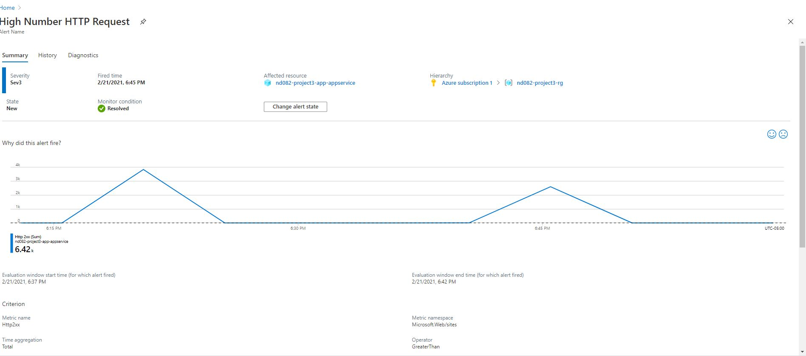

# Table of Contents

- **[Overview](#Overview)**
- **[Terraform](#Terraform)**
- **[PostMan for Application Testing](#PostMan-for-Application-Testing)**
- **[Selenium for User Interface Testing](#Selenium-for-User-Interface-Testing)**


## Overview

In this project we will use Azure DevOps to create a disposable test environment to run different automated tests on our application. We will use

- Postman for application test
- Selenium for User Interface test
- Jmeter for Load test

All of the above tests will leverage Azure DevOps platform. We will also use Terraform IAC to create the disposable test environment.

## Terraform

Terraform IAC is used to create the test environment. Code under the terraform modules will create out disposable test environment.

### Terraform State File Storage Account

We will create the terraform state file storage account using the script below

```bash
az_storage.sh
```

Take a note of the `client_id, client_secret, tenant_id, access_key` this will be needed for the terraform script to keep the terraform state file.


### Terraform create Test Environment

Terraform test environment will be created during different stages of the Pipeline.

- Build stage of the pipeline will do the Terraform Init and Plan operation
- Provision_Terraform_Resources stage of the pipeline will actually do the terraform apply which will provision our test Infrastructure.
- All sensitive variables will be passed as a Pipeline secret variable. 




## PostMan for Application Testing

We will be using PostMan for application testing. The result of the PostMan test will be published as Test Artifact during the Pipeline run. PostMan test is run during the execution of the Build stage of the pipeline




The artifact is downloaded from the Azure DevOps and available under the `project-submission-artifacts` folder.

## Selenium for User Interface Testing

Selenium is used to test the User Interface. The Selenium test will be run in the Azure VM created using the Terraform IAC. We included the Azure VM as a test environment resource in our DevOps project and the test will be directly run on this VM. Please see the link below to create an environment
[Creating Environments in Azure DevOps](https://docs.microsoft.com/en-us/azure/devops/pipelines/ecosystems/deploy-linux-vm?view=azure-devops&tabs=java)

Selenium test will be run during the Deploy stage of the pipeline.


### Azure Log Analytics

To collect the output of the Selenium test we will be leveraging the Azure Log Analytics service. This service will be configured to collect the application events, in our case the system log output of the Selenium Test run.




The data output from the test is available as `project-submission-artifacts/query_data.csv`.

## JMeter for Load Testing

JMeter will be used for Load Testing. Load and Endurance testing will be run against the FakeRestAPI in the Load_Test stage of the Pipeline. Load test is run against the Activities Endpoint and Endurance Test is run against the Book Endpoint. The result of the Load Test will also be available as a Test Artifact and will be uploaded to the Test Results.







The Load Test results are also available as `project-submission-artifacts/Stress-Test-Report.zip`, `project-submission-artifacts/Endurance-Test-Report.zip`.

### Azure Monitoring

We also monitor the performance of the application during Load test using Azure Monitor. We leverage the Azure App service Monitoring capabilities to generate custom alerts which can notify any infrastructure related issues.


